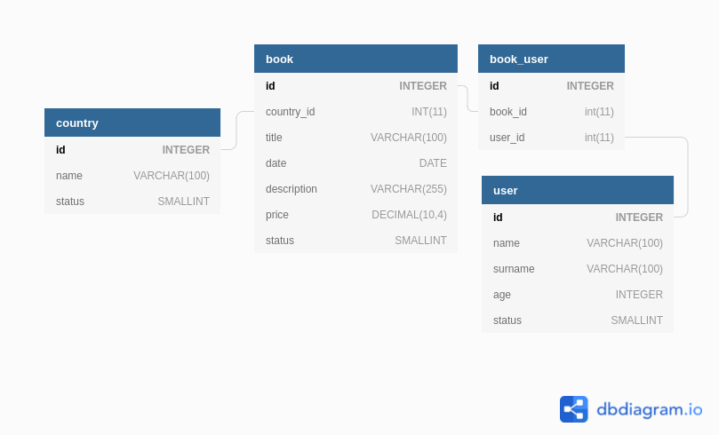

<h2>Query Filter Bundle</h2>

[](https://github.com/bugloos/query-filter-bundle/actions)

<h2>What does it do? :)</h2>
The query filter bundle allows you to filter data from QueryBuilder and the Database. you can filter multiple columns at the same time and also you can filter relation fields with two-level deep and without any join in your query builder.

<h2>Installation</h2>

```bash
composer require bugloos/query-filter-bundle
```

<h2>Compatibility</h2>

* PHP v8.1 or above
* Symfony v5.4 or above

<h2>Usage</h2>
Suppose our database has the following tables with the following relations



<strong>Now we want to filter Book entity</strong>

We want filter Book entity by `title` column, so we can send filter data by Querystring or with array in inline code like this:

```php
/*
 * Filter books by title column
*/
//Get api/book/index?filter[title]=text_for_search
OR
$filters = [
    'title' => 'text_for_search',
];
/*
 * Filter books by title column
*/
//Get api/book/index?filter[title]=text_for_search
OR
$filters = [
    'title' => 'text_for_search',
];
```

You just need to add QueryFilter class in controller:

```php
use Bugloos\QueryFilterBundle\Service\QueryFilter;
```

The following code is in Book controller.
<p>As you see, At first you should call for() method and pass QueryBuilder as parameter to this method</p>
<p>Then call parameters() method and pass filters request items</p>
<p>At the end you should call filter() method to run it</p>
The return of filter method is Query Builder, so you can add anything else to Query Builder after filtering.

```php
public function index(
    Request $request,
    BookRepository $bookRepository,
    QueryFilter $queryFilter
): Response {
    $queryBuilder = $bookRepository->createQueryBuilder('b');
    
    $queryBuilder = $queryFilter->for($queryBuilder)
        ->parameters($request->get('filters'))
        ->filter()
    ;
    
    return $queryBuilder->getQuery()->getResult();
}
```

<p>If you want to filter the ManyToOne relation field or one level deep relation, you should add mapper.</p>
<p>To add a mapper, you call addMapper() method to add single mapper or call mappers() method to add multiple mappers with array</p>
<p>First parameter of addMapper() method is parameter name and second parameter is relation name and its field name, which separate by " . " sign</p>

```php
$mappers = [
    'country' => 'country.name',
];
```

For example we want to filter Book entity by its Country name. Book has ManyToOne relation with Country entity

```php
/*
 * Filter books by country column
*/
//Get api/book/index?filter[country]=text_for_search
OR
$filters = [
    'country' => 'text_for_search',
];
/*
 * Filter books by country column
*/
//Get api/book/index?filter[country]=text_for_search
OR
$filters = [
    'country' => 'text_for_search',
];
```

The following code is in Book controller.

```php
public function index(
    Request $request,
    BookRepository $bookRepository,
    QueryFilter $queryFilter
): Response {
    $queryBuilder = $bookRepository->createQueryBuilder('b');
    
    $queryBuilder = $queryFilter->for($queryBuilder)
        ->parameters($request->get('filters'))
        ->addMapper('country', 'country.name')
        ->filter()
    ;
    
    return $queryBuilder->getQuery()->getResult();
}
```

**NOTE**: There is no need to add your relationship join in Query builder because if join is not added, I will add it automatically. ;)

```php
$queryBuilder = $bookRepository->createQueryBuilder('b');
OR
$queryBuilder = $bookRepository->createQueryBuilder('b')
    ->addSelect('country')   
    ->leftJoin('b.country', 'country')      
;
```

<p>If you want to filter the ManyToMany relation field or two level deep relation, you should again add mapper</p>

```php
$mapper = [
    'age' => 'bookUsers.user.age',
];
```

For example we want to filter Book entity by its Writers age. Book has ManyToMany relation with User entity

```php
/*
 * Filter books by Writers age column
*/
//Get api/book/index?filter[age]=31
OR
$filters = [
    'age' => 31,
];
/*
 * Filter books by Writers age column
*/
//Get api/book/index?filter[age]=31
OR
$filters = [
    'age' => 31,
];
```

The following code is in Book controller.

```php
public function index(
    Request $request,
    BookRepository $bookRepository,
    QueryFilter $queryFilter
): Response {
    $queryBuilder = $bookRepository->createQueryBuilder('b');
    
    $queryBuilder = $queryFilter->for($queryBuilder)
        ->parameters($request->get('filters'))
        ->addMapper('age', 'bookUsers.user.age')
        ->sort()
    ;
    
    return $queryBuilder->getQuery()->getResult();
}
```

**NOTE**: You should know that you can filter data with multiple columns too, you just need to send multiple filter data with a Query string like this:

```php
/*
 * Filter books by title and age
*/
//Get api/book/index?filter[title]=text&filter[age]=31
OR
$filters = [
    'title' => 'text',
    'age' => 31,
];
```

<h2>Suggestion</h2>

You can change two parameters with the config file, just make a yaml file in config/packages/ directory then you can change default cache time for queries and default relation separator as follows:

```yaml
query_filter:
  default_cache_time: 3600
  separator: '.'
```

**NOTE**: You can set the cache time for each query separately and if you don't set any cache time, it uses default cache time in your config file

```php
$queryBuilder = $queryFilter->for($queryBuilder)
    ->parameters($request->get('filters'))
    ->cacheTime(120)
    ->sort()
;
```
<h2>Contributing  </h2>

If you find an issue, or have a better way to do something, feel free to open an issue or a pull request.
